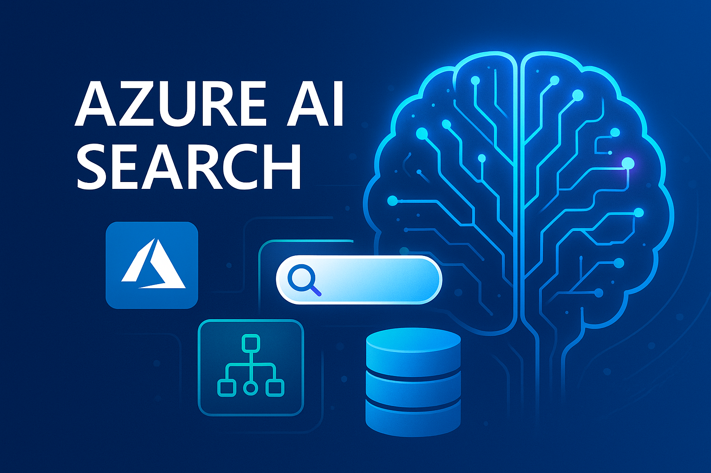
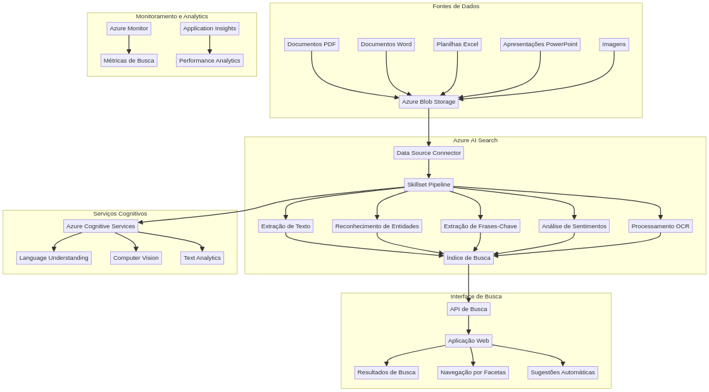

# Azure AI Search Platform

**Autor:** Gabriel Demetrios Lafis


[**Ver Código no GitHub**](https://github.com/galafis/Azure-Cognitive-Search-Utilizando-AI-Search-para-indexa-o-e-consulta-de-Dados)

## 🖼️ Imagem Hero




## 📁 Estrutura do Projeto

```
.
├── src/                 # Código fonte principal da aplicação Flask
│   ├── app.py           # Aplicação Flask principal
│   └── config.py        # Configurações da aplicação (ex: variáveis de ambiente)
├── tests/               # Testes unitários e de integração
├── data/                # Dados de exemplo para indexação
├── frontend/            # Interface do usuário (se aplicável)
├── .env                 # Variáveis de ambiente (NÃO commitado)
├── requirements.txt     # Dependências Python
├── setup_search_index.py # Script para criar o índice de busca no Azure AI Search
├── upload_sample_documents.py # Script para fazer upload de documentos de exemplo
├── CODE_OF_CONDUCT.md   # Código de Conduta
├── CONTRIBUTING.md      # Guia de Contribuição
├── LICENSE              # Licença do projeto
├── README.md            # Este arquivo README
└── advanced-hero-image.png # Imagem hero do projeto
```

---

## 🇧🇷 Plataforma de Busca com IA do Azure

### Visão Geral

Este projeto demonstra uma implementação avançada do Azure AI Search (anteriormente Azure Cognitive Search), uma plataforma de busca empresarial que utiliza inteligência artificial para indexação e consulta de dados. A solução apresenta um sistema completo de busca semântica, com capacidades de processamento de linguagem natural, extração de entidades e análise de sentimentos.

A plataforma é projetada para lidar com grandes volumes de dados não estruturados, como documentos, imagens e conteúdo multimídia, transformando-os em informações pesquisáveis e insights acionáveis. É uma demonstração prática de como implementar soluções de busca inteligente em ambientes corporativos.

### Funcionalidades Principais

- **Indexação Inteligente de Documentos**: O sistema processa automaticamente documentos em diversos formatos (PDF, Word, Excel, PowerPoint) e extrai texto, metadados e entidades relevantes para criar índices de busca otimizados.

- **Busca Semântica Avançada**: Utiliza modelos de linguagem natural para compreender a intenção por trás das consultas, permitindo buscas mais precisas e contextualmente relevantes, mesmo quando as palavras-chave exatas não estão presentes nos documentos.

- **Extração de Entidades e Frases-Chave**: O sistema identifica automaticamente pessoas, lugares, organizações, datas e conceitos importantes nos documentos, criando metadados ricos que melhoram a precisão das buscas.

- **Análise de Sentimentos**: Cada documento é analisado para determinar o sentimento geral (positivo, negativo ou neutro), permitindo filtros e análises baseadas no tom do conteúdo.

- **Sugestões Automáticas e Autocompletar**: A interface de busca oferece sugestões em tempo real e funcionalidade de autocompletar, melhorando significativamente a experiência do usuário.

- **Facetas e Filtros Dinâmicos**: Os resultados de busca podem ser filtrados dinamicamente por tipo de documento, data de criação, autor, sentimento e outras facetas extraídas automaticamente.

- **Interface de Busca Responsiva**: Uma interface web moderna e intuitiva, construída com HTML, CSS e JavaScript, que oferece uma experiência de busca rica e interativa.

- **API RESTful Completa**: Endpoints bem documentados para integração com outras aplicações, permitindo buscas programáticas e integração com sistemas existentes.

### Arquitetura da Solução

O diagrama a seguir ilustra a arquitetura da Plataforma de Busca com IA do Azure:



### Como Executar o Projeto

#### Pré-requisitos

- Assinatura ativa do Microsoft Azure
- Azure CLI instalado e configurado
- Python 3.8+ e `pip` para gerenciamento de dependências
- Conhecimento básico de serviços Azure

#### Configuração dos Recursos Azure

1.  **Criar Grupo de Recursos:**

    ```bash
    az group create --name rg-aisearch-demo --location "East US"
    ```

2.  **Criar Serviço Azure AI Search:**

    ```bash
    az search service create --name aisearch-demo-service --resource-group rg-aisearch-demo --sku Standard
    ```

3.  **Criar Conta de Armazenamento:**

    ```bash
    az storage account create --name aisearchdemostorage --resource-group rg-aisearch-demo --location "East US" --sku Standard_LRS
    ```

4.  **Criar Serviços Cognitivos:**

    ```bash
    az cognitiveservices account create --name aisearch-cognitive --resource-group rg-aisearch-demo --kind CognitiveServices --sku S0 --location "East US"
    ```

#### Configuração da Aplicação

1.  **Clone o repositório:**

    ```bash
    git clone https://github.com/galafis/Azure-Cognitive-Search-Utilizando-AI-Search-para-indexa-o-e-consulta-de-Dados.git
    cd Azure-Cognitive-Search-Utilizando-AI-Search-para-indexa-o-e-consulta-de-Dados
    ```

2.  **Configure as variáveis de ambiente:**

    Crie um arquivo `.env` na raiz do projeto com as seguintes configurações (substitua os valores pelos seus):

    ```ini
    AZURE_SEARCH_SERVICE_NAME=seu-nome-do-servico-search
    AZURE_SEARCH_API_KEY=sua-chave-de-api-do-search
    AZURE_STORAGE_CONNECTION_STRING=sua-connection-string-do-storage
    AZURE_COGNITIVE_SERVICES_KEY=sua-chave-dos-servicos-cognitivos
    AZURE_SEARCH_ENDPOINT=https://seu-nome-do-servico-search.search.windows.net
    AZURE_SEARCH_INDEX=documents
    ```

3.  **Instale as dependências:**

    ```bash
    pip install -r requirements.txt
    ```

4.  **Execute os scripts de configuração:**

    ```bash
    python setup_search_index.py
    python upload_sample_documents.py
    ```

5.  **Inicie a aplicação web:**

    ```bash
    python src/app.py
    ```

6.  **Acesse a interface:**

    Abra seu navegador e acesse `http://localhost:5000`.

### Casos de Uso Empresariais

- **Gestão de Conhecimento**: Busca inteligente em bases de conhecimento corporativo, manuais e documentação técnica.
- **Compliance e Auditoria**: Localização rápida de documentos relevantes para auditorias e verificações de conformidade.
- **Atendimento ao Cliente**: Busca em bases de conhecimento para suporte técnico e FAQ.
- **Pesquisa Jurídica**: Busca semântica em contratos, políticas e documentos legais.
- **Análise de Conteúdo**: Extração de insights e tendências de grandes volumes de documentos corporativos.

---

## 🇺🇸 Azure AI Search Platform

### Overview

This project demonstrates an advanced implementation of Azure AI Search (formerly Azure Cognitive Search), an enterprise search platform that uses artificial intelligence for data indexing and querying. The solution presents a complete semantic search system with natural language processing capabilities, entity extraction, and sentiment analysis.

The platform is designed to handle large volumes of unstructured data, such as documents, images, and multimedia content, transforming them into searchable information and actionable insights. It is a practical demonstration of how to implement intelligent search solutions in corporate environments.

### Key Features

- **Intelligent Document Indexing**: The system automatically processes documents in various formats (PDF, Word, Excel, PowerPoint) and extracts text, metadata, and relevant entities to create optimized search indexes.

- **Advanced Semantic Search**: Uses natural language models to understand the intent behind queries, enabling more precise and contextually relevant searches, even when exact keywords are not present in documents.

- **Entity and Key Phrase Extraction**: The system automatically identifies people, places, organizations, dates, and important concepts in documents, creating rich metadata that improves search accuracy.

- **Sentiment Analysis**: Each document is analyzed to determine overall sentiment (positive, negative, or neutral), enabling filters and analyses based on content tone.

- **Auto-suggestions and Autocomplete**: The search interface offers real-time suggestions and autocomplete functionality, significantly improving user experience.

- **Dynamic Facets and Filters**: Search results can be dynamically filtered by document type, creation date, author, sentiment, and other automatically extracted facets.

- **Responsive Search Interface**: A modern and intuitive web interface, built with HTML, CSS, and JavaScript, that offers a rich and interactive search experience.

- **Complete RESTful API**: Well-documented endpoints for integration with other applications, enabling programmatic searches and integration with existing systems.

### Solution Architecture

The architecture of the Azure AI Search Platform is illustrated in the diagram above in the Portuguese section.

### How to Run the Project

#### Prerequisites

- Active Microsoft Azure subscription
- Azure CLI installed and configured
- Python 3.8+ and `pip` for dependency management
- Basic knowledge of Azure services

#### Azure Resources Configuration

1.  **Create Resource Group:**

    ```bash
    az group create --name rg-aisearch-demo --location "East US"
    ```

2.  **Create Azure AI Search Service:**

    ```bash
    az search service create --name aisearch-demo-service --resource-group rg-aisearch-demo --sku Standard
    ```

3.  **Create Storage Account:**

    ```bash
    az storage account create --name aisearchdemostorage --resource-group rg-aisearch-demo --location "East US" --sku Standard_LRS
    ```

4.  **Create Cognitive Services:**

    ```bash
    az cognitiveservices account create --name aisearch-cognitive --resource-group rg-aisearch-demo --kind CognitiveServices --sku S0 --location "East US"
    ```

#### Application Configuration

1.  **Clone the repository:**

    ```bash
    git clone https://github.com/galafis/Azure-Cognitive-Search-Utilizando-AI-Search-para-indexa-o-e-consulta-de-Dados.git
    cd Azure-Cognitive-Search-Utilizando-AI-Search-para-indexa-o-e-consulta-de-Dados
    ```

2.  **Configure environment variables:**

    Create a `.env` file in the project root with the following settings (replace values with yours):

    ```ini
    AZURE_SEARCH_SERVICE_NAME=your-search-service-name
    AZURE_SEARCH_API_KEY=your-search-api-key
    AZURE_STORAGE_CONNECTION_STRING=your-storage-connection-string
    AZURE_COGNITIVE_SERVICES_KEY=your-cognitive-services-key
    AZURE_SEARCH_ENDPOINT=https://your-search-service-name.search.windows.net
    AZURE_SEARCH_INDEX=documents
    ```

3.  **Install dependencies:**

    ```bash
    pip install -r requirements.txt
    ```

4.  **Run configuration scripts:**

    ```bash
    python setup_search_index.py
    python upload_sample_documents.py
    ```

5.  **Start the web application:**

    ```bash
    python src/app.py
    ```

6.  **Access the interface:**

    Open your browser and go to `http://localhost:5000`.

### Enterprise Use Cases

- **Knowledge Management**: Intelligent search in corporate knowledge bases, manuals, and technical documentation.
- **Compliance and Auditing**: Quick location of relevant documents for audits and compliance checks.
- **Customer Support**: Search in knowledge bases for technical support and FAQ.
- **Legal Research**: Semantic search in contracts, policies, and legal documents.
- **Content Analysis**: Extraction of insights and trends from large volumes of corporate documents.

